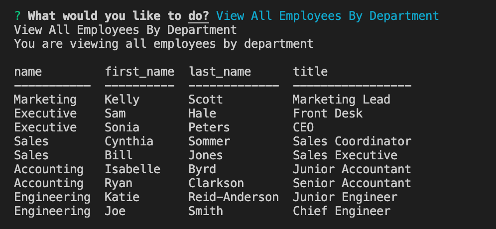

# Employee Management System

## Goals
- The goal of this project was to create an employee management system. Ultimately through mysql you would be able to update employee information, roles, and departments all by following the steps given to you.

## Process
- For each individual option (ex. View All Employees or Updtate Employee Role), I created a function that would run by accessing the mysql database and tables. From there it would gather the information it needs, pass it through the response and the response would be shown in the terminal

## Technology Used
- console.table
- mysql
- inquirer

## Issues
- I was unable to figure out how to add names together in the console.table so that instead of showing the manager id, it would just show the managers name.